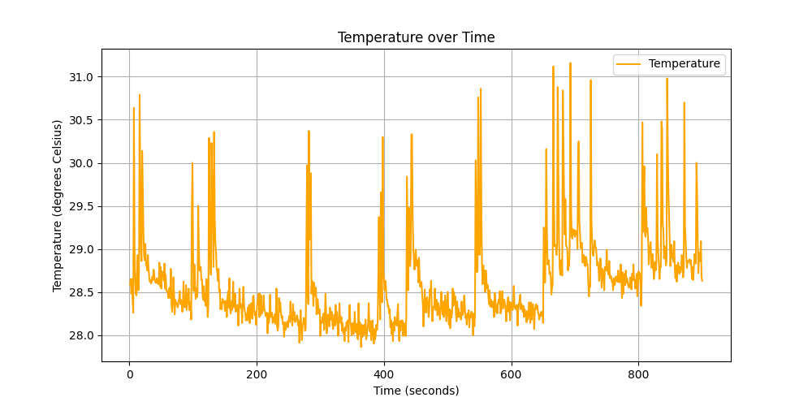
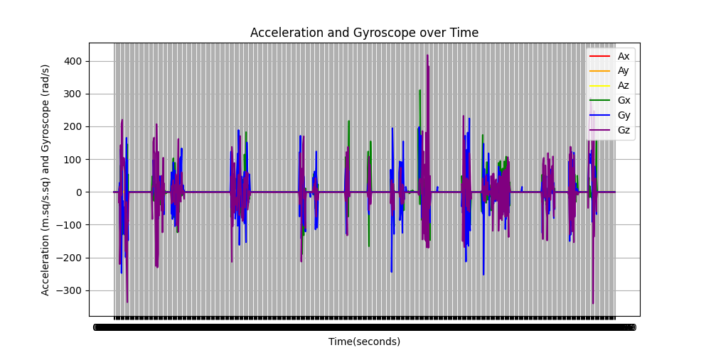
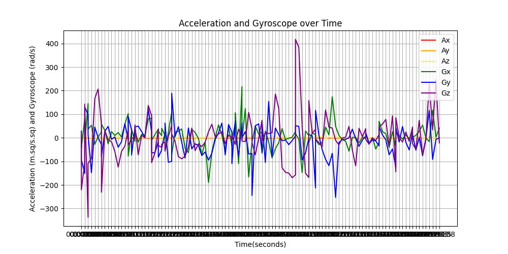
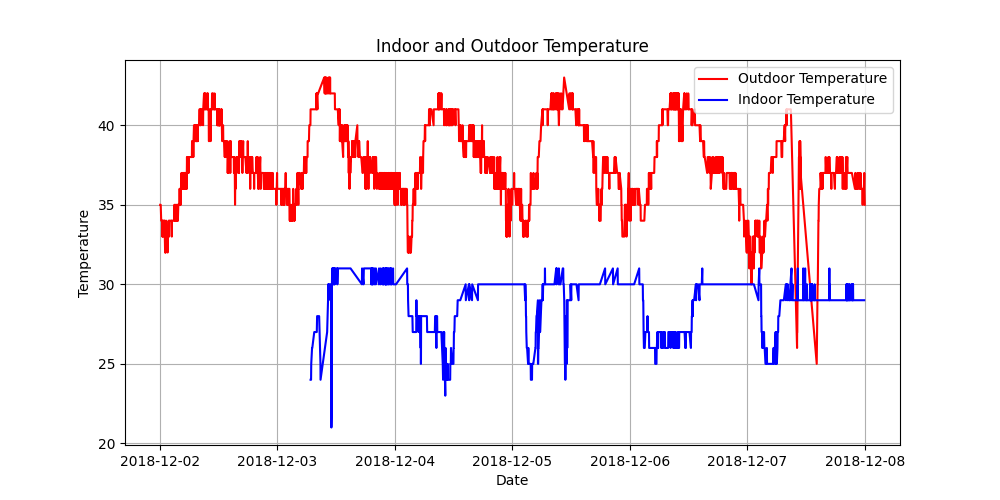
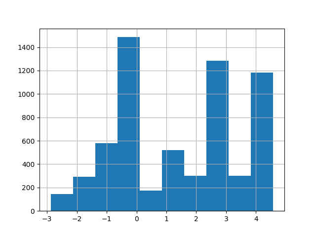
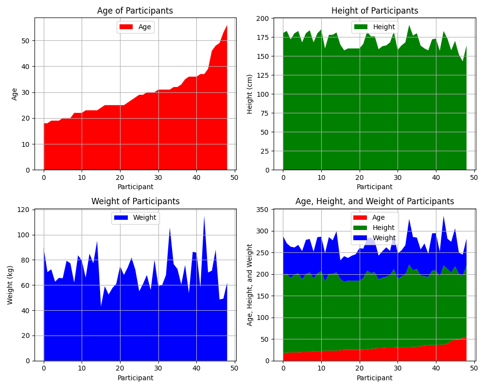
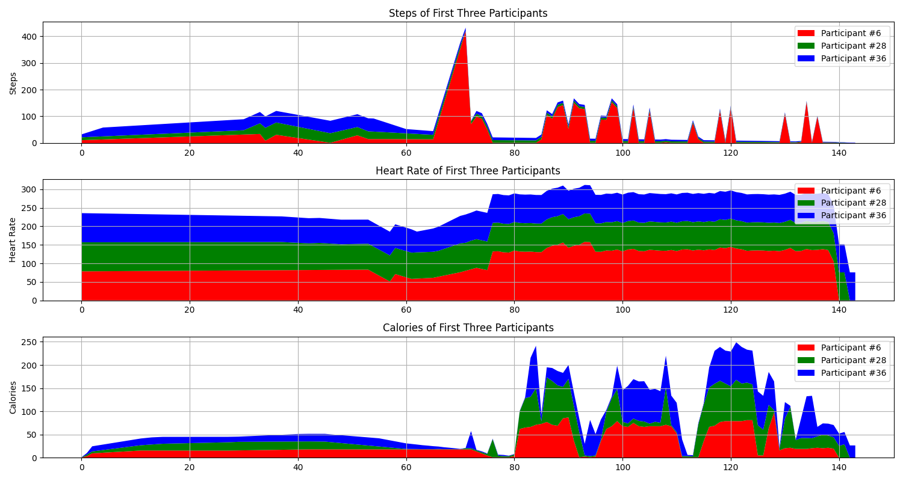
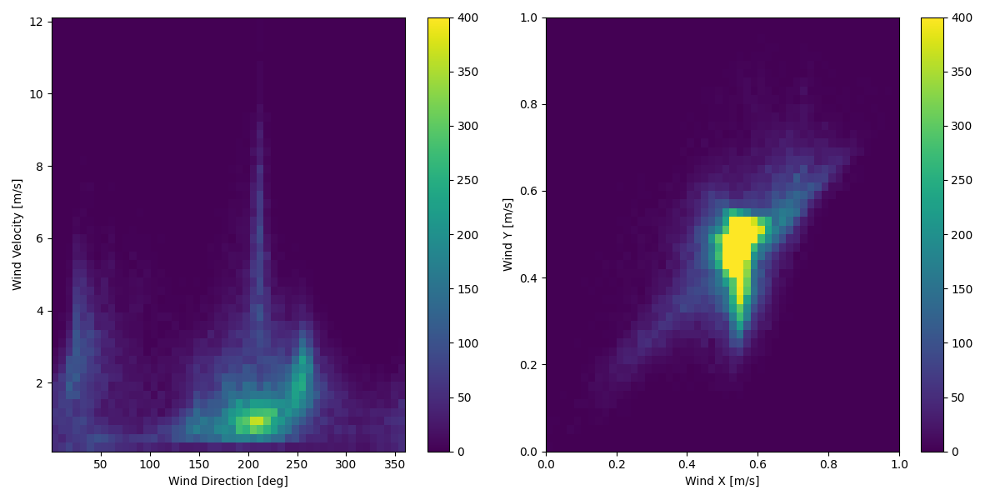

# Lab 2: Assignments (20 pts- 15 Mandatory/5 Optional)

## Task A2.1: Temperature Logging and Collection (3 points - Mandatory)

In this task, you should record the temperature data from Arduino Nano RP2040. The frequency of the record is to be at least 1 Hz (1 second). Record the data for at least 15 minutes (900 data rows or more). To make the temperature vary a bit, do several "hot blow"s like "huh"s or "blows" on the board or simply put your finger on the sensor while recording the data. Save them into a CSV. Remember to Submit both CSV and your Python Code.

Hint: To turn your logging data into CSV file, there are some third-party software online that you can use or IDE script which does that.

### I- Collect the data in a CSV file and submit it with the rest of your results (2pts-Mandatory)

```c++
#include <Arduino.h>
#include <Arduino_LSM6DSOX.h>

void setup() {
    Serial.begin(115200);
    while (!Serial);  // Wait for Serial Monitor to open

    if (!IMU.begin()) {
        Serial.println("Failed to initialize IMU!");
        while (1);
    }
    Serial.println("Timestamp,Temperature(C)");
}

void loop() {
    float temperature;
    if (IMU.temperatureAvailable()) {
        temperature = 0;
        IMU.readTemperatureFloat(temperature);
        Serial.print(millis());      // Timestamp (ms)
        Serial.print(",");
        Serial.println(temperature); // Temperature in Celsius
    }
    delay(1000); // Log every second
}
```

[**Data/temperature.csv**](./Data/temperature.csv)
```csv
Timesteps,Temperature
1,28.58
2,28.65
3,28.48
4,28.65
```

### II- Visualize the data with a line graph with two axes: time & temperature with criteria below (1pt-Mandatory)

* The color of the line should be orange
* Add labels for each axes (Temperature (degrees Celsius), Time(seconds)),
* Turn on the grids 
* Add legend on the top right corner - temperature

```python
def TaskA2_1_II():
    # Read the CSV file
    df = pd.read_csv("lab2/Data/temperature.csv")
    # Plot the data
    plt.figure(figsize=(10, 5))
    plt.plot(df["Timesteps"], df["Temperature"], color="orange", label="Temperature")
    plt.xlabel("Time (seconds)")
    plt.ylabel("Temperature (degrees Celsius)")
    plt.title("Temperature over Time")
    plt.grid(True)
    plt.legend(loc="upper right")
    plt.show()
```

 
## Task A2.2: Motion Logging - Acc/Gyr  and Collection (5 points - Mandatory)

In this task, you should record the motion data from Arduino Nano RP2040. The frequency of the record is to be at least 2 Hz (0.5 second). Record the data for at least 10 minutes (1200 rows or more). You should collect both accelerometer and gyroscope data. Wiggle the Arduino slightly and abruptly (!) in different directions and angles (Do both angles and directions!) while collecting the motion, to have some peaks in your data. Save them into a CSV. Do the wiggles in certain intervals so you get something like the figure below. 

Hint: To record date and time you can use RTC module and library, but for the sake of simplicity, you don't need to use that for this task. You can define the starting date and time on top of your sketch and use the "Delay" command to define the data logging intervals.

### I- Collect the data in a CSV file and submit it with the rest of your results (2pts-Mandatory)

```c++
#include <Arduino.h>
#include <Arduino_LSM6DSOX.h>
#include <TimeLib.h> 

time_t startTime;
unsigned long startMillis;

void setup() {
    Serial.begin(115200);
    while (!Serial);  // Wait for Serial Monitor to open

    if (!IMU.begin()) {
        Serial.println("Failed to initialize IMU!");
        while (1);
    }
    Serial.println("Date,Time,Ax,Ay,Az,Gx,Gy,Gz");
    startMillis = millis();
    startTime = now(); 
}

void loop() {
    float ax, ay, az;
    float gx, gy, gz;
    if (IMU.accelerationAvailable() && IMU.gyroscopeAvailable()) {
        IMU.readAcceleration(ax, ay, az);
        IMU.readGyroscope(gx, gy, gz);

        unsigned long currentMillis = millis();
        time_t currentTime = startTime + (currentMillis - startMillis) / 1000;

        char timeBuffer[9];
        snprintf(timeBuffer, sizeof(timeBuffer), "%02d:%02d:%02d", hour(currentTime), minute(currentTime), second(currentTime));

        // Print the date and time
        Serial.print("2025-02-07");
        Serial.print(",");
        Serial.print(timeBuffer);
        Serial.print(",");
        Serial.print(ax); // Acceleration in X
        Serial.print(",");
        Serial.print(ay); // Acceleration in Y
        Serial.print(",");
        Serial.print(az); // Acceleration in Z
        Serial.print(",");
        Serial.print(gx); // Gyroscope in X
        Serial.print(",");
        Serial.print(gy); // Gyroscope in Y
        Serial.print(",");
        Serial.println(gz); // Gyroscope in Z
    }
    delay(500); // Log every 0.5 second
}
```
[**Data/acceleration.csv**](./Data/acceleration.csv)
```csv
Date,Time,Ax,Ay,Az,Gx,Gy,Gz
2025-02-07,00:00:01,-0.02,0.02,1.00,0.06,0.00,-0.79
2025-02-07,00:00:02,-0.02,0.02,1.00,0.06,0.00,-0.73
2025-02-07,00:00:02,-0.02,0.02,1.00,0.06,-0.06,-0.79
2025-02-07,00:00:03,-0.02,0.02,1.00,0.12,0.06,-0.73
```

### II- Visualize the data with a line graph with two axes with criteria below (1pt-Mandatory)

* plot 6 axis of data
* Add labels for each axes (Acceleration (m.sq/s.sq), Time(seconds)),
* Turn on the grids 
* Add legend on the top right corner - the name of your plots should be Ax, Ay, Az, Gx, Gy, Gz
* Remember to Submit both CSV and your Python Code.

```python
def TaskA2_2_II():
    # Read the CSV file
    df = pd.read_csv("lab2/Data/acceleration.csv")
    # Plot the data
    plt.figure(figsize=(10, 5))
    plt.plot(df["Time"], df["Ax"], color="red", label="Ax")
    plt.plot(df["Time"], df["Ay"], color="orange", label="Ay")
    plt.plot(df["Time"], df["Az"], color="yellow", label="Az")
    plt.plot(df["Time"], df["Gx"], color="green", label="Gx")
    plt.plot(df["Time"], df["Gy"], color="blue", label="Gy")
    plt.plot(df["Time"], df["Gz"], color="purple", label="Gz")
    plt.xlabel("Time(seconds)")
    plt.ylabel("Acceleration (m.sq/s.sq) and Gyroscope (rad/s)")
    plt.title("Acceleration and Gyroscope over Time")
    plt.grid(True)
    plt.legend(loc="upper right")
    plt.show()
```


### III- (Manipulate the data) With one of the the functions mentioned in the instruction above, write a code which deletes rows of data from your dataset that the acceleration is 0 or close to 0. This will compress your signals to look something like the right graphs below in Fig. 9. Visualize the data again with the above criteria in a line graph. Pay attention that you need to look at the data and define the threshold accordingly for deleting stationary data. The threshold might be different for different axes  (2pt-Mandatory)

```python
def TaskA2_2_III():
    # Read the CSV file
    df = pd.read_csv("lab2/Data/acceleration.csv")
    # Remove rows where acceleration values are close to 0
    df = df[(df["Ax"].abs() > 0.02) & (df["Ay"].abs() > 0.03) & (df["Az"].abs() > 1)]
    # Plot the data
    plt.figure(figsize=(10, 5))
    plt.plot(df["Time"], df["Ax"], color="red", label="Ax")
    plt.plot(df["Time"], df["Ay"], color="orange", label="Ay")
    plt.plot(df["Time"], df["Az"], color="yellow", label="Az")
    plt.plot(df["Time"], df["Gx"], color="green", label="Gx")
    plt.plot(df["Time"], df["Gy"], color="blue", label="Gy")
    plt.plot(df["Time"], df["Gz"], color="purple", label="Gz")
    plt.xlabel("Time(seconds)")
    plt.ylabel("Acceleration (m.sq/s.sq) and Gyroscope (rad/s)")
    plt.title("Acceleration and Gyroscope over Time")
    plt.grid(True)
    plt.legend(loc="upper right")
    plt.show()
```


## Task A2.3: Frozen! (5 points- Mandatory)

This is a dataset of collecting in/out temperature data over 5 months in (appx. 97000 data rows): Temperature Readings

### I- Visualize the indoor and outdoor temperature in one plot with different colors of your choice for the last week (strat from the top 02-12-2018 to 08-12-2018). (2 pts-Mandatory)

```python
def TaskA2_3_I():
    df = pd.read_csv("lab2/Data/IOT-Temperature.csv")

    df["noted_date"] = pd.to_datetime(df["noted_date"], dayfirst=True)

    df = df[(df["noted_date"] >= pd.to_datetime("2018-12-02")) & (df["noted_date"] <= pd.to_datetime("2018-12-08"))]

    plt.figure(figsize=(10, 5))
    plt.plot(df[df["out/in"] == "Out"]["noted_date"],df[df["out/in"] == "Out"]["temp"],color="red",label="Outdoor Temperature",)
    plt.plot(df[df["out/in"] == "In"]["noted_date"],df[df["out/in"] == "In"]["temp"],color="blue",label="Indoor Temperature",)
    plt.xlabel("Date")
    plt.ylabel("Temperature")
    plt.title("Indoor and Outdoor Temperature")
    plt.grid(True)
    plt.legend(loc="upper right")
    plt.show()
```


### II- Do these modifications on the dataframe made from the CSV dataset: (3pts Mandatory)

* Change the "In" and "Out" text of the "Out\In" column to 1 and 0 respectively.
* Separate the date and time in the "noted_date" column, into two separate columns.
* Keep only the data of the last day 08-12-2018, and remove the rest of the rows with the appropriate function
* Submit the modified CSV and your code together.

```python
def TaskA2_3_II():
    df = pd.read_csv("lab2/Data/IOT-Temperature.csv")

    df["out/in"] = df["out/in"].apply(lambda x: 1 if x == "Out" else 0)

    df["noted_date"] = pd.to_datetime(df["noted_date"], dayfirst=True)
    df["date"] = df["noted_date"].dt.date
    df["time"] = df["noted_date"].dt.time

    df = df[df["date"] == pd.to_datetime("2018-12-08").date()]

    df = df.drop("noted_date", axis=1)

    df.to_csv("lab2/Data/IOT-Temperature-Modified.csv", index=False)
```
[**Data/IOT-Temperature-Modified.csv**](./Data/IOT-Temperature-Modified.csv)
```csv
id,room_id/id,temp,out/in,date,time
__export__.temp_log_196134_bd201015,Room Admin,29,0,2018-12-08,09:30:00
__export__.temp_log_196131_7bca51bc,Room Admin,29,0,2018-12-08,09:30:00
__export__.temp_log_196127_522915e3,Room Admin,41,1,2018-12-08,09:29:00
__export__.temp_log_196128_be0919cf,Room Admin,41,1,2018-12-08,09:29:00
```

## Task A2.4: Digital Health IoT dataset (7 points - Mandatory/Optional)

Dataset #1: A sample of 49 participants using an Apple Watch and a "FitBit" app for 65 minutes for 46 participants. This data was collected as part of a Harvard dataset (6265 rows): Apple Watch and Fitbit dataLinks to an external site., there are three files inside archive. We will be focusing on "aw_fb_data"

### I- Based on the instruction on the distribution transformation, transform the "calories" column to take the shape of a distribution close to normal distribution. The current distribution looks something like the below figure. Experiment with different transforms (log, cube, etc.) to find the right one. Use a transform to make the data distribution more consistent, meaning there are values on each column (1pts - Mandatory)

```python
def TaskA2_4_I():
    df = pd.read_csv("lab2/Data/aw_fb_data.csv")

    df["log"] = np.log(df["calories"])
    df["log"].hist()

    plt.show()
```


### II- As mentioned before, the data reflects 49 participants. Make a copy of the original dataframe and Find a way to keep one sample from each participant.  Therefore, the new dataframe should have 49 rows. You should use a specific function or a mix of functions in the instruction. Afterward, visualize the "age", "height", and "weight" of the participants on each subplot (stacked plot). Grids should be on, Legends should be on top, and The color of the line plot for each subplot should be different. (2pts - Optional)

```python
def plot_participant_data(ax, x, y_data, labels, colors, title, xlabel, ylabel):
    ax.stackplot(x, *y_data, labels=labels, colors=colors)
    ax.set_title(title)
    ax.set_xlabel(xlabel)
    ax.set_ylabel(ylabel)
    ax.legend(loc="upper center")
    ax.grid(True)


def TaskA2_4_II():
    df = pd.read_csv("lab2/Data/aw_fb_data.csv")
    df_copy = df.groupby(["age", "height", "weight"]).first().reset_index()

    _, axs = plt.subplots(2, 2, figsize=(10, 8))

    plot_participant_data(
        axs[0, 0],
        df_copy.index,
        [df_copy["age"]],
        ["Age"],
        ["red"],
        "Age of Participants",
        "Participant",
        "Age",
    )
    plot_participant_data(
        axs[0, 1],
        df_copy.index,
        [df_copy["height"]],
        ["Height"],
        ["green"],
        "Height of Participants",
        "Participant",
        "Height (cm)",
    )
    plot_participant_data(
        axs[1, 0],
        df_copy.index,
        [df_copy["weight"]],
        ["Weight"],
        ["blue"],
        "Weight of Participants",
        "Participant",
        "Weight (kg)",
    )
    plot_participant_data(
        axs[1, 1],
        np.arange(len(df_copy)),
        [df_copy["age"], df_copy["height"], df_copy["weight"]],
        ["Age", "Height", "Weight"],
        ["red", "green", "blue"],
        "Age, Height, and Weight of Participants",
        "Participant",
        "Age, Height, and Weight",
    )

    plt.tight_layout()
    plt.show()
```


### III- Visualize "steps", "heart_rate", and "calories" of the first three participants in three plots with subplots (stacked plot), in a way that the steps of each three participants are depicted with different colored lines, the same for other two datasets. The legends should be on the top corner of each plot (participant #1, participant #2, participant#3) (2pts - Mandatory)

```python
def pad_and_stackplot(ax, data, max_len, labels, colors, title, ylabel):
    padded_data = [
        np.pad(participant_data, (0, max_len - len(participant_data))) for participant_data in data
    ]
    ax.stackplot(np.arange(max_len), padded_data, labels=labels, colors=colors)
    ax.set_title(title)
    ax.set_ylabel(ylabel)
    ax.legend(loc="upper right")
    ax.grid(True)


def TaskA2_4_III():
    # Read the CSV file
    df = pd.read_csv("lab2/Data/aw_fb_data.csv")

    df_unique = pd.read_csv("lab2/Data/aw_fb_data_Unique.csv")
    df_unique["id"] = range(1, len(df_unique) + 1)
    unique_id_cols = ["age", "height", "weight", "gender"]
    df_merged = df.merge(df_unique[unique_id_cols + ["id"]], on=unique_id_cols, how="left")

    id1, id2, id3 = 6, 28, 36

    participant_1 = df_merged[df_merged["id"] == id1]
    participant_2 = df_merged[df_merged["id"] == id2]
    participant_3 = df_merged[df_merged["id"] == id3]

    max_len = max(len(participant_1), len(participant_2), len(participant_3))

    _, axs = plt.subplots(3, 1, figsize=(15, 8))

    pad_and_stackplot(
        axs[0],
        [participant_1["steps"], participant_2["steps"], participant_3["steps"]],
        max_len,
        labels=[f"Participant #{id1}", f"Participant #{id2}", f"Participant #{id3}"],
        colors=["red", "green", "blue"],
        title="Steps of First Three Participants",
        ylabel="Steps",
    )

    pad_and_stackplot(
        axs[1],
        [participant_1["hear_rate"], participant_2["hear_rate"], participant_3["hear_rate"]],
        max_len,
        labels=[f"Participant #{id1}", f"Participant #{id2}", f"Participant #{id3}"],
        colors=["red", "green", "blue"],
        title="Heart Rate of First Three Participants",
        ylabel="Heart Rate",
    )

    pad_and_stackplot(
        axs[2],
        [participant_1["calories"], participant_2["calories"], participant_3["calories"]],
        max_len,
        labels=[f"Participant #{id1}", f"Participant #{id2}", f"Participant #{id3}"],
        colors=["red", "green", "blue"],
        title="Calories of First Three Participants",
        ylabel="Calories",
    )

    plt.tight_layout()
    plt.show()
```


### IV- Normalize the "age", "height", and "weight", and Standardize "steps" and "heart rate" columns in a separate column at the end of the dataframe (1pts - Mandatory)
```python
def normalize_column(df, column_name):
    min_value = np.min(df[column_name])
    max_value = np.max(df[column_name])
    df[f"{column_name}"] = (df[column_name] - min_value) / (max_value - min_value)
    return df


def standardize_column(df, column_name):
    mean_target = np.mean(df[column_name])
    sd_target = np.std(df[column_name])
    df[f"{column_name}_standardized"] = (df[column_name] - mean_target) / (sd_target)
    return df


def TaskA2_4_IV():
    df = pd.read_csv("lab2/Data/aw_fb_data.csv")

    df = normalize_column(df, "age")
    df = normalize_column(df, "height")
    df = normalize_column(df, "weight")

    df = standardize_column(df, "steps")
    df = standardize_column(df, "hear_rate")

    df.to_csv("lab2/Data/aw_fb_data_Normalized_Standardized.csv", index=False)
```
[**Data/aw_fb_data_Normalized_Standardized.csv**](Data/aw_fb_data_Normalized_Standardized.csv)
```csv
Unnamed: 0,X1,age,gender,height,weight,steps,hear_rate,calories,distance,entropy_heart,entropy_setps,resting_heart,corr_heart_steps,norm_heart,intensity_karvonen,sd_norm_heart,steps_times_distance,device,activity,steps_standardized,hear_rate_standardized
1,1,0.05263157894736842,1,0.5208333333333334,0.31111111111111117,10.7714285714286,78.5313023809524,0.344532850241546,0.0083268571428571,6.2216117239699,6.11634856607516,59.0,1.0,19.5313023809524,0.138519875042215,1.0,0.0896921469387755,apple watch,Lying,-0.4434454826518626,-0.2656916476716687
2,2,0.05263157894736842,1,0.5208333333333334,0.31111111111111117,11.4753246753247,78.4533902777777,3.28762546296296,0.0088963463203463,6.2216117239699,6.11634856607516,59.0,1.0,19.4533902777777,0.137967306934594,1.0,0.102088462450104,apple watch,Lying,-0.44028588253285755,-0.2684114632223761
3,3,0.05263157894736842,1,0.5208333333333334,0.31111111111111117,12.1792207792208,78.5408250801282,9.484,0.0094658354978355,6.2216117239699,6.11634856607516,59.0,1.0,19.5408250801282,0.138587411915803,1.0,0.115286500387924,apple watch,Lying,-0.43712628241385254,-0.2653592219733791
4,4,0.05263157894736842,1,0.5208333333333334,0.31111111111111117,12.8831168831169,78.6282598824786,10.1545555555556,0.0100353246753247,6.2216117239699,6.11634856607516,59.0,1.0,19.6282598824786,0.139207516897011,1.0,0.129286260752235,apple watch,Lying,-0.4339666822948475,-0.2623069807243856
5,5,0.05263157894736842,1,0.5208333333333334,0.31111111111111117,13.587012987013,78.715694684829,10.8251111111111,0.0106048138528139,6.2216117239699,6.11634856607516,59.0,0.982815702386645,19.715694684829,0.13982762187822,0.241567027237508,0.144087743543037,apple watch,Lying,-0.43080708217584246,-0.259254739475392
```

### V- Split the dataset into three categories with the following distribution: Train (70%), Validation (15%), and Test (15%) (1pts - Mandatory)
```python
def TaskA2_4_V():
    df = pd.read_csv("lab2/Data/aw_fb_data.csv")

    train_df, temp_df = train_test_split(df, test_size=0.3, random_state=42)
    validation_df, test_df = train_test_split(temp_df, test_size=0.5, random_state=42)

    print(f"Train set size: {len(train_df)}")
    print(f"Validation set size: {len(validation_df)}")
    print(f"Test set size: {len(test_df)}")
```
Output:
* Train set size: 4384
* Validation set size: 940
* Test set size: 940


Submit both the CSV file and your code.

## Task A2.5: Gone with the Wind!  (3pts - Optional)

You are presented with a dataset of wind speed and the wind angle of the wind from a meteorological site. The problem is that some data while being so similar have values very differently. Angles are not ideal as model inputs since 360° and 0° should be in close proximity, smoothly transitioning. The direction becomes irrelevant when there is no wind blowing. (for example 0.1m/s at 359° is not represented well or the similarity of 10 m/s at 0.1° and 359.9°). The model will find it more straightforward to interpret if you transform the columns for wind direction and velocity into a wind vector (X and Y).

Download the weather dataset from here: Climate2016.csvDownload Climate2016.csv

We only focus on the columns "windvelo m/s" and "winddeg deg" which represent wind velocity and wind direction. See the data summary with the functions in the text to get the overview of the data

Use mathematical functions to convert the Wind "speed&velocity" vector into two separate X & Y vectors. Add two more columns to your CSV file as windveloX and windveloY, and save your CSV file.
Use the normalize function to normalize the data
Use the "Hist2d" function to visualize the data before and after changes. It should look something like the two below figures 

Hint: Use bins parameter equal to (50, 50) and vmax equal to 400 for the "hist2d" function to get the better results.

Submit both the CSV file and your code.


```python
def TaskA2_5():
    df = pd.read_csv("lab2/Data/Climate2016.csv")

    df["windveloX"] = df["windvelo (m/s)"] * np.cos(np.radians(df["winddeg (deg)"]))
    df["windveloY"] = df["windvelo (m/s)"] * np.sin(np.radians(df["winddeg (deg)"]))

    df["norm_windveloX"] = (df["windveloX"] - df["windveloX"].min()) / (
        df["windveloX"].max() - df["windveloX"].min()
    )
    df["norm_windveloY"] = (df["windveloY"] - df["windveloY"].min()) / (
        df["windveloY"].max() - df["windveloY"].min()
    )

    df.to_csv("lab2/Data/Climate2016_Normalized.csv", index=False)

    plt.figure(figsize=(12, 6))
    plt.subplot(1, 2, 1)
    plt.hist2d(df["winddeg (deg)"], df["windvelo (m/s)"], bins=50, vmax=400)
    plt.colorbar()
    plt.xlabel("Wind Direction [deg]")
    plt.ylabel("Wind Velocity [m/s]")

    plt.subplot(1, 2, 2)
    plt.hist2d(df["norm_windveloX"], df["norm_windveloY"], bins=50, vmax=400)
    plt.colorbar()
    plt.xlabel("Wind X [m/s]")
    plt.ylabel("Wind Y [m/s]")

    plt.tight_layout()
    plt.show()
```


[**Data/Climate2016_Normalized.csv**](Data/Climate2016_Normalized.csv)
```csv
Date Time,press (mbar),Temp (degC),Temppot (K),Tempdew (degC),relativehum (%),VPressmax (mbar),VPressact (mbar),VPressdef (mbar),sh (g/kg),H2OC (mmol/mol),relativeho (g/m**3),windvelo (m/s),max. windvelo (m/s),winddeg (deg),windveloX,windveloY,norm_windveloX,norm_windveloY
01.01.2016 00:00:00,999.08,-0.01,273.22,-0.44,96.9,6.1,5.91,0.19,3.69,5.92,1271.32,1.16,2.04,192.4,-1.1329398428676345,-0.2490929795137935,0.5171044370624132,0.4746623558695411
01.01.2016 00:10:00,999.03,0.01,273.25,-0.41,97.0,6.11,5.93,0.18,3.7,5.94,1271.16,1.01,2.12,211.6,-0.8602442034844783,-0.5292257650297797,0.5325611625178573,0.4536701422746951
01.01.2016 00:20:00,999.07,0.06,273.29,-0.36,97.0,6.13,5.95,0.18,3.71,5.96,1270.97,0.8,1.52,203.8,-0.7319677342798598,-0.3228362370819122,0.5398320311367123,0.4691362828995447
01.01.2016 00:30:00,999.09,0.07,273.3,-0.36,96.9,6.14,5.95,0.19,3.71,5.96,1270.93,0.77,1.64,184.2,-0.7679321474628328,-0.05639341178827622,0.537793523803068,0.48910261668327476
```

