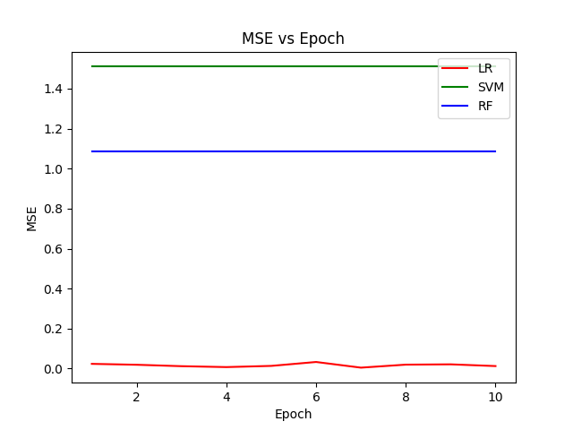
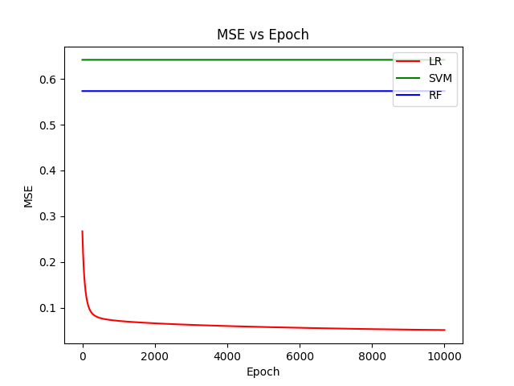
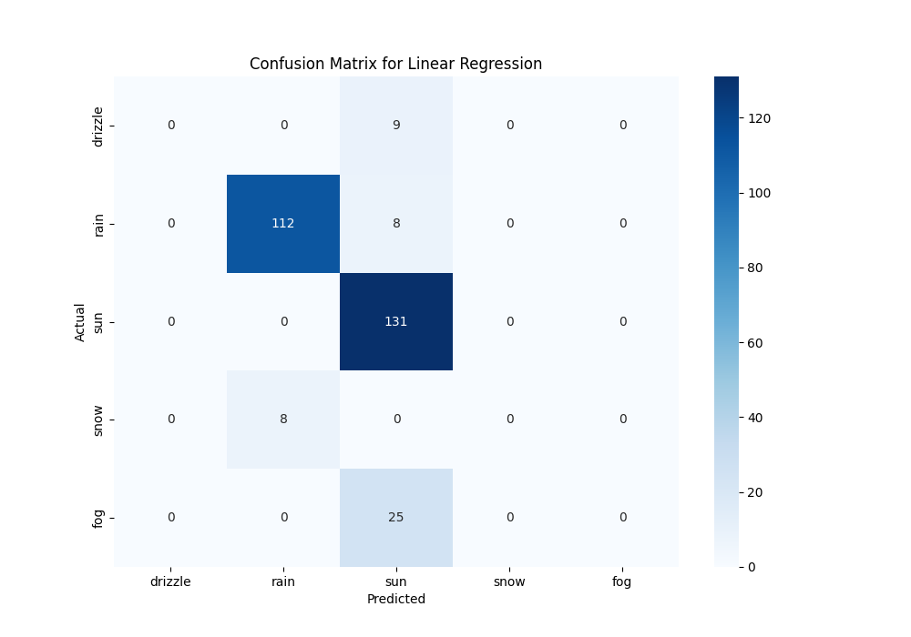
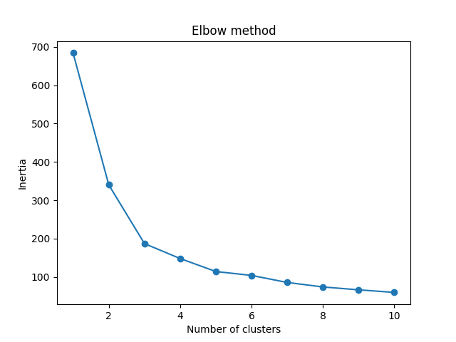
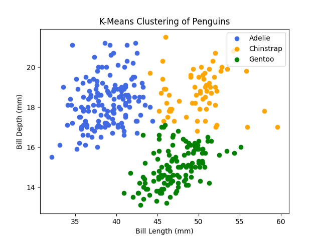
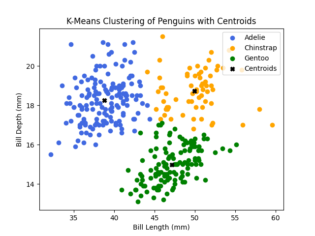

# Section5: Assignment (30 pts - 15Mandatory/15 Optional)
## Task A.3.1: Handwriting Recognition (8 points- Mandatory)

The MNIST dataset: MNIST is a large database of handwritten digits that is commonly used for training various image processing systems. The database is also widely used for training and testing in the field of machine learning. This dataset contains 6000 images for training and 10000 images for testing the out-of-sample performance. Here, let's use the simple algorithms in this lab to build a handwriting model!

Go to the following link, describing how to import the MNIST  dataset and code a logistic regression algorithm for handwriting recognition.  External Link - [MNIST dataset LOGISTIC REGRESSION](https://machinelearningmastery.com/building-a-logistic-regression-classifier-in-pytorch/)

### Import the MNIST dataset.
```python
def load_data():
    train_dataset = datasets.MNIST(
        root="./Lab3/Data", train=True, transform=transforms.ToTensor(), download=True
    )
    test_dataset = datasets.MNIST(
        root="./Lab3/Data", train=False, transform=transforms.ToTensor()
    )
    train_data = train_dataset.data[:10000].view(-1, 28 * 28).numpy()
    train_labels = train_dataset.targets[:10000].numpy()
    test_data = test_dataset.data.view(-1, 28 * 28).numpy()
    test_labels = test_dataset.targets.numpy()
    return train_data, train_labels, test_data, test_labels
```

### I-Use linear regression and SVM (with Linear kernel) and Random Forest(with a maximum depth of your choice) algorithms to classify the hand-written numbers in 10 output classes (0-9) (5 pts-Mandatory)
#### Linear Regression
```python
def linear_regression():
    train_dataset = datasets.MNIST(
        root="./Lab3/Data", train=True, transform=transforms.ToTensor(), download=True
    )
    test_dataset = datasets.MNIST(
        root="./Lab3/Data", train=False, transform=transforms.ToTensor()
    )

    BATCH_SIZE = 32
    N_INPUTS = 28 * 28
    N_OUTPUTS = 10
    LEARNING_RATE = 0.01
    EPOCHS = 10

    train_loader = DataLoader(train_dataset, BATCH_SIZE, shuffle=True)
    test_loader = DataLoader(test_dataset, BATCH_SIZE, shuffle=False)

    device = torch.device("cuda" if torch.cuda.is_available() else "cpu")
    print(torch.cuda.is_available())

    # Initialize the model, loss function, and optimizer
    model = LinearRegression(N_INPUTS, N_OUTPUTS)

    loss_function = nn.MSELoss()
    optimizer = optim.Adam(model.parameters(), LEARNING_RATE)  # defining the optimizer

    mse_list = []
    for epoch in range(EPOCHS):
        for images, labels in train_loader:
            images, labels = images.to(device), labels.to(device)
            # Clear gradient buffers because we don't want any gradient from previous epoch to carry forward, dont want to cummulate gradients
            optimizer.zero_grad()
            # get output from the model, given the inputs
            outputs = model(images.view(-1, 28 * 28))

            labels_one_hot = nn.functional.one_hot(labels, num_classes=10).float()
            # get loss for the predicted output
            loss = loss_function(outputs, labels_one_hot)
            # get gradients w.r.t to parameters
            loss.backward()
            # update parameters
            optimizer.step()
        mse_list.append(loss.item())
        correct = 0
        for images, labels in test_loader:
            images, labels = images.to(device), labels.to(device)
            outputs = model(images.view(-1, 28 * 28))
            _, predicted = torch.max(outputs.data, 1)
            correct += (predicted == labels).sum()
        accuracy = 100 * (correct.item()) / len(test_dataset)
        print("Epoch: {}. Loss: {}. Accuracy: {}".format(epoch, loss.item(), accuracy))
```
#### Support Vector Machine
```python
def support_vector_machine(train_data, train_labels, test_data, test_labels):
    model = svm.SVC(kernel="linear")
    model.fit(train_data, train_labels)
    predictions = model.predict(test_data)
    accuracy = accuracy_score(test_labels, predictions)
    mse = mean_squared_error(test_labels, predictions)
    print(f"SVM Accuracy: {accuracy*100:.2f}%")
    return mse
```
#### Random Forest
```python
def random_forest(train_data, train_labels, test_data, test_labels):
    model = RandomForestClassifier(max_depth=10)
    model.fit(train_data, train_labels)
    predictions = model.predict(test_data)
    accuracy = accuracy_score(test_labels, predictions)
    mse = mean_squared_error(test_labels, predictions)
    print(f"Random Forest Accuracy: {accuracy*100:.2f}%")
    return mse
```
```console
$ /.venv/bin/python /Lab3/Lab3.py
Epoch: 0. Loss: 0.010662739165127277. Accuracy: 91.42
Epoch: 1. Loss: 0.02252594195306301. Accuracy: 91.67
Epoch: 2. Loss: 0.02010655775666237. Accuracy: 91.98
Epoch: 3. Loss: 0.015999723225831985. Accuracy: 92.15
Epoch: 4. Loss: 0.009851353242993355. Accuracy: 92.01
Epoch: 5. Loss: 0.020732557401061058. Accuracy: 91.77
Epoch: 6. Loss: 0.020547622814774513. Accuracy: 92.06
Epoch: 7. Loss: 0.01092042401432991. Accuracy: 91.99
Epoch: 8. Loss: 0.006635814905166626. Accuracy: 92.29
Epoch: 9. Loss: 0.01594471000134945. Accuracy: 92.11
SVM Accuracy: 91.23%
Random Forest Accuracy: 93.82%
```
### II-Visualize the MSE error against Epoch for 3 algorithms in one line plot, with different colors for each algorithm. A legend should be on the top corner ("SVM", "LR", "RF") (3 pts-Mandatory)
```python
def visualize_errors(lr_mse, svm_mse, rf_mse):
    epochs = range(1, len(lr_mse) + 1)
    plt.plot(epochs, lr_mse, "r", label="LR")
    plt.plot(epochs, [svm_mse] * len(lr_mse), "g", label="SVM")
    plt.plot(epochs, [rf_mse] * len(lr_mse), "b", label="RF")
    plt.xlabel("Epoch")
    plt.ylabel("MSE")
    plt.legend(loc="upper right")
    plt.title("MSE vs Epoch")
    plt.show()
```

## Task A.3.2: Predict the Rain!  - IOT DATA (12 pts - Mandatory/Optional)

In this task, you have given the weather conditions of Seattle, Washington State, US. Given the assumption that the input data is a prediction of the next day's weather, you should predict the output, weather condition, of tomorrow

The input is the min./max. temperature, precipitation, and wind. Your task is to find out how the weather is going to be based on these parameters. There are 5 output classes: (1)drizzle, (2)rain, (3)sun, (4)snow, (5)fog 

Download the dataset from the Kaggle website-  External Link: Seattle Weather Dataset Download External Link: [Seattle Weather Dataset](./Data/seattle-weather.csv)(approx. 1460Rows)

 

### Import the dataset.
```python
def load_data():
    df = pd.read_csv("./Lab3/Data/seattle-weather.csv")
    df = df.dropna()
    df = df.drop(columns=["date"])  # Drop the date column
    X = df.drop(columns=["weather"])
    y = df["weather"].map({"drizzle": 0, "rain": 1, "sun": 2, "snow": 3, "fog": 4})
    X_train, X_test, y_train, y_test = train_test_split(X, y, test_size=0.2, random_state=42)
    scaler = StandardScaler()
    X_train = scaler.fit_transform(X_train)
    X_test = scaler.transform(X_test)
    return X_train, y_train, X_test, y_test
```

### I-Use Linear regression, SVM (with Linear kernel), and Random Forest(with a maximum depth of less than 10) algorithms to classify the weather data in 5 output classes: "drizzle", "rain", "sun", "snow", "fog"  (5 pts-Mandatory)

#### Linear Regression
```python
def linear_regression():
    EPOCHS = 10000
    N_INPUTS = X_train.shape[1]
    N_OUPUTS = 5
    LEARNING_RATE = 0.01

    model = LinearRegression(N_INPUTS, N_OUPUTS)
    criterion = nn.MSELoss()
    optimizer = optim.Adam(model.parameters(), LEARNING_RATE)

    inputs = torch.tensor(X_train, dtype=torch.float32)
    labels = torch.tensor(y_train.values, dtype=torch.long)
    test_inputs = torch.tensor(X_test, dtype=torch.float32)
    test_labels = torch.tensor(y_test.values, dtype=torch.long)

    mse_list = []
    for epoch in range(EPOCHS):
        model.train()
        optimizer.zero_grad()
        outputs = model(inputs)
        labels_one_hot = nn.functional.one_hot(labels, num_classes=5).float()
        loss = criterion(outputs, labels_one_hot)
        loss.backward()
        optimizer.step()
        mse_list.append(loss.item())

        # Print epoch loss
        print(f"Epoch {epoch+1}/{EPOCHS}, Loss: {loss.item()}")

        # Calculate accuracy
        model.eval()
        with torch.no_grad():
            test_outputs = model(test_inputs)
            _, predicted = torch.max(test_outputs.data, 1)
            cm = confusion_matrix(test_labels, predicted)
            accuracy = (predicted == test_labels).sum().item() / len(y_test)
            print(f"Epoch {epoch+1}/{EPOCHS}, Accuracy: {accuracy*100:.2f}%")
```
#### Support Vector Machine
```python
def support_vector_machine(train_data, train_labels, test_data, test_labels):
    model = svm.SVC(kernel="linear")
    model.fit(train_data, train_labels)
    predictions = model.predict(test_data)
    accuracy = accuracy_score(test_labels, predictions)
    mse = mean_squared_error(test_labels, predictions)
    print(f"SVM Accuracy: {accuracy*100:.2f}%")
    return mse
```
#### Random Forest
```python
def random_forest(train_data, train_labels, test_data, test_labels):
    model = RandomForestClassifier(max_depth=10)
    model.fit(train_data, train_labels)
    predictions = model.predict(test_data)
    accuracy = accuracy_score(test_labels, predictions)
    mse = mean_squared_error(test_labels, predictions)
    print(f"Random Forest Accuracy: {accuracy*100:.2f}%")
    return mse
```
```console
$ /.venv/bin/python /Lab3/Lab3.py
Epoch 9997/10000, Accuracy: 82.94%
Epoch 9998/10000, Loss: 0.050995949655771255
Epoch 9998/10000, Accuracy: 82.94%
Epoch 9999/10000, Loss: 0.050995223224163055
Epoch 9999/10000, Accuracy: 82.94%
Epoch 10000/10000, Loss: 0.050994500517845154
Epoch 10000/10000, Accuracy: 82.94%
SVM Accuracy: 77.82%
Random Forest Accuracy: 82.59%
```
### II-Visualize the MSE error against Epoch for 3 algorithms in one line plot, with different colors for each algorithm. A legend should be on the top corner ("SVM", "LR", "RF") (2 pts-Mandatory)
```python
def visualize_errors(lr_mse, svm_mse, rf_mse):
    epochs = range(1, len(lr_mse) + 1)
    plt.plot(epochs, lr_mse, "r", label="LR")
    plt.plot(epochs, [svm_mse] * len(lr_mse), "g", label="SVM")
    plt.plot(epochs, [rf_mse] * len(lr_mse), "b", label="RF")
    plt.xlabel("Epoch")
    plt.ylabel("MSE")
    plt.legend(loc="upper right")
    plt.title("MSE vs Epoch")
    plt.show()
```


### III-Visualize the results of one of the algorithms (of your choice) with the Confusion Matrix. The matrix should be 5x5. You can read more about it in [This Link](https://en.wikipedia.org/wiki/Confusion_matrix). (5pts-Optional)




## Task A.3.3: Guess where did I GO! (Arduino Inertia) (5 pts - Optional)

In this task you will train a machine learning model to predict which direction the Arduino moves toward. This is just an example (and impractical!) way of predicting the direction of the Arduino, as it can be understood by looking at ACC_X, ACC_Y, and ACC_Z immediately. But lets do the hard work and do it with a simple ML algorithm!

I-Collect 40 data records with low frequency (100Hz) and duration of 1 second each, in which in 20 of them you move the Arduino Right ->, and in another 20 you move the Arduino Left <-. The process can be done with an Arduino IDE script or through the EdgeImpulse website. (2pts Optional)

Export the data as JSON. Use the script here to transform them to CSV, or import them to Python with a script like below. Note that each data is a time series array and not a single variable. 

 
```python
def load_json_data(json_files):
    data = []
    for file in json_files:
        with open(file, 'r') as f:
            json_data = json.load(f)
            # Assuming JSON data is in the form of a time-series array
            data.append(json_data)
    return data
```
### II- Write a linear regression ML code with the five steps described in the instruction above, specified, to guess the label of the data. "left" or "right". (3pts Optional)

Note #1: As a reminder, the accelerometer detects the acceleration or in other words changes in the speed. therefore your move should be fast and jerky to activate the sensor. 

Note #2: As the population of the dataset is very small, PAY ATTENTION to labeling the data "left" or "right" correctly. Double-check your labeling as one wrong label can result in a malfunction of your ML algorithm.

Submit your data collected in a zip file and your Python code.

 

## Task A.3.4: Classify the Pinguins (Unsupervised) (5 pts - Optional)

This dataset is the classification of 3 types of penguins based on the length of their bill (or beak).  Here, you should build a K-means clustering model and evaluate your model in terms of accuracy.

### Load the dataset of Pinguins: [penguins.csv](./Data/penguins.csv) . We only need 3 columns of the dataset: "species", "bill_length_mm", and "bill_depth_mm". the data distribution is shown in the below figure.
```python
df = pd.read_csv(
    "./Lab3/Data/penguins.csv", 
    usecols=["species", "bill_length_mm", "bill_depth_mm"]
)
df = df.dropna()
X = df[["bill_length_mm", "bill_depth_mm"]]
scaler = StandardScaler()
X = scaler.fit_transform(X)
```
### Build a K-means clustering model to cluster the penguins' types based on "bill_length_mm" and "bill_depth_mm". Visualize the clusters in an XY plane, like the figure below but with the result of your mode. Put the "centroids" of each cluster in the figure. 

#### Elbow Method
```python
inertias = []
# testing the data on 1 to 11 clusters and calculating the inertia
for i in range(1, 11):
    kmeans = KMeans(n_clusters=i)
    kmeans.fit(X)
    inertias.append(kmeans.inertia_)

plt.plot(range(1, 11), inertias, marker="o")
plt.title("Elbow method")
plt.xlabel("Number of clusters")
plt.ylabel("Inertia")
plt.show()
```


#### Building K-means clustering model
```python
kmeans = KMeans(n_clusters=3, init="k-means++", n_init=20, random_state=42)
# kmeans = KMeans(n_clusters=3)
df["cluster"] = kmeans.fit_predict(X)

# Map cluster labels to species names
cluster_to_species = {0: "Adelie", 2: "Chinstrap", 1: "Gentoo"}
df["species_cluster"] = df["cluster"].map(lambda x: cluster_to_species[x])
```

#### Clustering
```python
# Visualizing the clusters
for cluster, color in zip(cluster_to_species.values(), ["royalblue", "orange", "green"]):
    cluster_data = df[df["species_cluster"] == cluster]
    plt.scatter(
        cluster_data["bill_length_mm"],
        cluster_data["bill_depth_mm"],
        label=cluster,
        color=color,
    )

plt.xlabel("Bill Length (mm)")
plt.ylabel("Bill Depth (mm)")
plt.title("K-Means Clustering of Penguins")
plt.legend(loc="upper right")
plt.show()
```


#### Clustering with centroids
```python
# Inverse transform the centroids back to the original scale
centroids = scaler.inverse_transform(kmeans.cluster_centers_)
for cluster, color in zip(cluster_to_species.values(), ["royalblue", "orange", "green"]):
    cluster_data = df[df["species_cluster"] == cluster]
    plt.scatter(
        cluster_data["bill_length_mm"],
        cluster_data["bill_depth_mm"],
        label=cluster,
        color=color,
    )
plt.scatter(centroids[:, 0], centroids[:, 1], c="black", marker="X", label="Centroids")
plt.xlabel("Bill Length (mm)")
plt.ylabel("Bill Depth (mm)")
plt.title("K-Means Clustering of Penguins with Centroids")
plt.legend(loc="upper right")
plt.show()
```



### Evaluate the model and find the accuracy of your model
```python
correct_labels = sum(df["species"] == df["species_cluster"])
accuracy = correct_labels / len(df)
print(f"K-Means Clustering Accuracy: {accuracy*100:.2f}%")
```
```console
$ /.venv/bin/python /Lab3/Lab3.py
K-Means Clustering Accuracy: 92.69%
```

